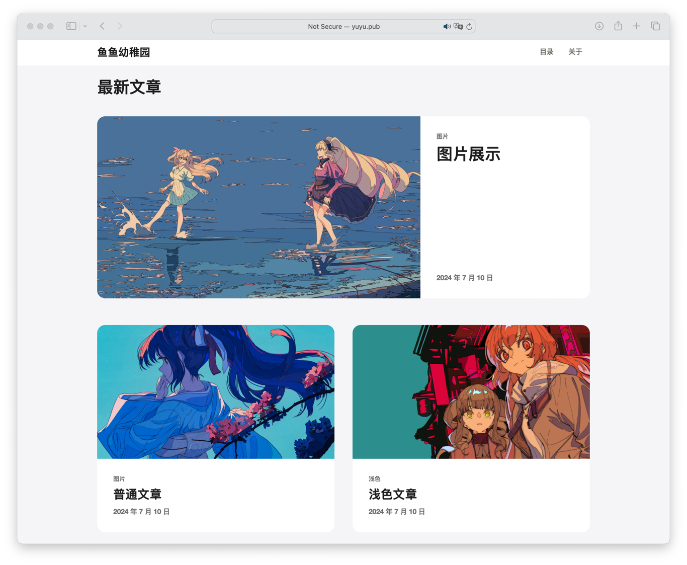

## 复刻[Apple Newsroom](https://www.apple.com/newsroom/)的一个博客网站，基于Astro和Django，前后端分离     


# 特色
* Apple风格，简约，简约的很
* 微服务，Docker容器化，并且还能借助GitHub Action的cicd功能自动更新
* Apple Newsroom不支持深色模式，但AppleBlog支持浅色和深色自动切换！
* 两种不同风格的图片，还有特色文章的动画
* 流畅的非线性动画，妙，非常妙
# 预览
[本人的网站](http://yuyu.pub)

###### _浅色模式_


###### _深色模式_


###### _文章_


# 部署
### Docker部署（推荐）

_AppleBlog在每个环节都适配了Docker，使用docker可以：_
1. 轻松部署
2. 集成nginx，加快网站访问
3. 容器自动更新


#### 部署非常简单：

1.	安装好docker，下载仓库根目录里的[postgres_data](postgres_data)文件夹和[docker-compose.yml](docker-compose.yml)和[media](media)目录（自己创建一个也可以，目录里还需要有个子目录，也就是media/post_images）[db.json](Django/db.json)初始数据库文件，一起放在一个文件夹里  
同一个文件夹下应该有这些：
```
postgres_data
docker-compose.yml
media/post_images
db.json
``` 

2.	运行命令`docker-compose up`，就会从docker hub拉取镜像，自动运行，并且每分钟会自动检测是否有更新，若有更新则自动更新容器

3. 第一次运行你会发现数据库没有数据而运行失败，这时候需要导入初始数据库，执行以下命令：

```
docker cp ./db.json backend:/app/

docker-compose exec backend python manage.py makemigrations

docker-compose exec backend python manage.py migrate

docker-compose exec backend python manage.py loaddata db.json
```
4. 然后重启容器，`docker-compose restart`，就可以正常运行了


#### 可选功能：
1. 允许从公网访问管理后台：出于安全原因，管理后台只允许本地访问，如果想从公网访问便于管理，替换 `docker-compose.yml `中 `backend `容器   `- DJANGO_ALLOWED_HOSTS=localhost,127.0.0.1,backend,SERVER_NAME`
   中的`SERVER_NAME`为你的服务器域名

2. 配置nginx（推荐）：nginx可以让网站从80端口直接访问，并加快网站请求速度，AppleBlog已经写好了nginx的配置文件，并且对于常见的压缩请求，图片缓存等做了适配，可以让网站打开速度快几倍，推荐部署   

   详细请查看nginx的文件夹，需要运行请在配置文件里增加你自己的服务器地址，里面有一个docker-compose.yml，可以直接运行`docker-compose up`运行nginx

### 从源码部署
当然，也可以从源码部署

#### postgresql

请自行安装postgresql，并且创建一个数据库
数据库的配置如下：
```
    'default': {
        'ENGINE': 'django.db.backends.postgresql',
        'NAME': os.environ.get('POSTGRES_DB', 'postgres'),
        'USER': os.environ.get('POSTGRES_USER', 'postgres'),
        'PASSWORD': os.environ.get('POSTGRES_PASSWORD', 'pYrdip-kevset-mihby2'),
        'HOST': os.environ.get('POSTGRES_HOST', '127.0.0.1'),
        'PORT': os.environ.get('POSTGRES_PORT', '5433'),
    }
```

#### Astro
1.	安装nodejs
2. 进入astro文件夹，`npm install`安装依赖
3. `npm run dev --host`运行前端

#### Django
1.	安装python
2. 进入Django文件夹，运行`pip install -r requirements.txt`安装依赖
3. 运行`python manage.py runserver`运行后端

初始化数据库：
```
python manage.py makemigrations

python manage.py migrate

python manage.py loaddata db.json
```

# 运行

上一步部署好后，运行项目。  
  
`localhost:3000`即可打开网站,  
`localhost:8000/admin`是管理后台，账号密码都是admin（请登录后自行修改）

# 修改网站标题和脚注
进入管理界面，打开`Web configs`，可以看到我已经预设好了配置，只需要对比网页和数据库的配置，修改即可：
```
        SITE_TITLE: '鱼鱼幼稚园',
        SITE_DESCRIPTION: '鱼鱼的日常冒泡',
        Footer1_Title: '导航',
        Footer1_Website1_title: '首页',
        Footer1_Website1_url: '/',
        Footer1_Website2_title: '目录',
        Footer1_Website2_url: '/archive',
        Footer2_Title: '仓库',
        Footer2_Website1_title: 'GitHub',
        Footer2_Website1_url: 'https://github.com/xieyumc/AppleBlog',
        Footer3_Title: '作者',
        Footer3_Website1_title: '鱼鱼',
        Footer3_Website1_url: 'https://github.com/xieyumc'
```

修改完必须重启前端才会生效，  
`docker-compose down`关闭容器，`docker-compose up`重新启动
# 编辑文章
打开管理后台，点击`文章`，点击`添加文章`，填写文章信息


文章有以下内容：   
* Available：是否显示文章，可以用来隐藏文章
* title：文章标题    
* description：文章描述
* content：文章内容，使用Markdown格式
* date published：发布日期
* author：作者
* cover_url：封面图片链接，直接填写图片链接即可
* tags：标签，以“,”分割，如`Apple,iPhone`
* theme：主题，选择文章主题为 `Auto` 或 `dark`，Auto是根据用户系统深/浅色自动切换文章深浅色
* featured：是否为特色文章，特色文章会把封面图放在文章开头作为背景，并且标题和描述文字会有动画效果

# 给文章内容添加图片
AppleBlog预设了2种图片格式，若要给文章插入图片请使用以下格式：

大图片：
```
<div class="img-container">

</div>
```

小图片：
```
<div class="img-container">

</div>
```

图片链接可以直接填写图床链接，或者云服务商的对象存储服务链接等等，只要能在公网访问即可

当然，我也给后端加了一个图床的功能：

### 使用后端图床功能
使用后端图床前请确保你的后端是可以被公网访问的（用docker部署参考可选功能1）  

访问管理界面的`blog`中的`images`，点击添加图片


1. post：选择图片所属文章
2. image：选择图片
3. alt：图片描述

图片添加后，可以看到分配了一个文章内序号`IMAGE_NUMBER`


在文章中插入图片时，图片路径填写
```
http://服务器ip地址:8000/api/img/post/文章序号/图片文章内序号/
```

比如
```
http://100.1.1.1:8000/api/img/post/1/1/
```
这样就是插入了第一篇文章的第一张图片

**注意⚠️，这里的ip地址会被用户前端直接访问，所以ip地址请填写服务器ip，而不是localhost**

后端图床功能完全独立，所以甚至可以把后端图床部署到国内服务器，AppleBlog部署到国外服务器，这样可以加快图片访问速度，又不需要国内网站备案

# 配置nginx实现http/3以及https
可以参考以下配置
```
# HTTPS for yuyu.pub
    server {
        listen 443 ssl;
        listen 443 quic;
        http2 on;

        listen [::]:443 quic;

        server_name yuyu.pub;

        ssl_certificate /etc/nginx/certs/yuyu.pub.pem;
        ssl_certificate_key /etc/nginx/certs/yuyu.pub.key;
        ssl_protocols TLSv1.2 TLSv1.3;
        ssl_ciphers HIGH:!aNULL:!MD5;

        location / {
            proxy_pass http://127.0.0.1:3000;
            proxy_set_header Host $host;
            proxy_set_header X-Real-IP $remote_addr;
            proxy_set_header X-Forwarded-For $proxy_add_x_forwarded_for;
            proxy_set_header X-Forwarded-Proto $scheme;
            add_header Alt-Svc 'h3=":443"; ma=86400';
        }
    }
```

# 联系
如果喜欢这个博客，欢迎star🥰  

如果有问题，欢迎提issue

QQ群：757490039 密码1234
