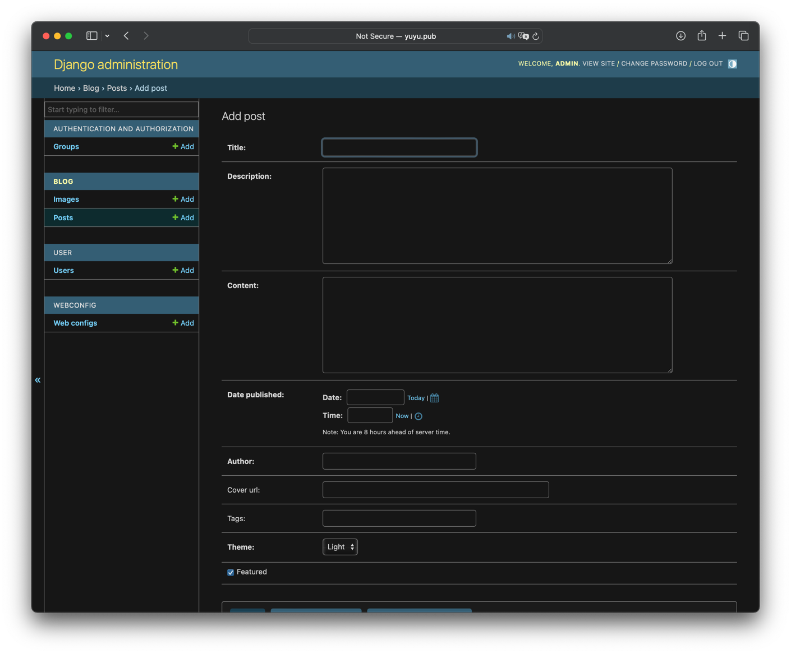

## 复刻[Apple Newsroom](https://www.apple.com/newsroom/)的一个博客网站，基于Astro和Django，前后端分离     


# 预览
[本人的网站](http://yuyu.pub)

###### _浅色模式_


###### _深色模式_


###### _文章_


# 部署
### Docker部署（推荐）

_AppleBlog在每个环节都适配了Docker，使用docker可以：_
1. 轻松部署
2. 集成nginx，加快网站访问
3. 容器自动更新


#### 部署非常简单，只需要2步：

1.	安装好docker，下载仓库根目录里的[db.sqlite3](db.sqlite3)和[docker-compose.yml](docker-compose.yml)和[media](media)目录（自己创建一个也可以，目录里还需要有个子目录，也就是media/post_images），一起放在一个文件夹里  
同一个文件夹下应该有这些文件：
```
db.sqlite3
docker-compose.yml
media/post_images
``` 

2.	运行命令`docker-compose up`，就会从docker hub拉取镜像，自动运行，并且每分钟会自动检测是否有更新，若有更新则自动更新容器

#### 可选功能：
_1. 允许从公网访问管理后台：出于安全原因，管理后台只允许本地访问，如果想从公网访问便于管理，替换 `docker-compose.yml `中 `backend `容器   `- DJANGO_ALLOWED_HOSTS=localhost,127.0.0.1,backend,SERVER_NAME`
   中的`SERVER_NAME`为你的服务器域名_    

_2. 配置nginx：nginx可以让网站从80端口直接访问，并加快网站请求速度，AppleBlog已经写好了nginx的配置文件，只需要替换 `docker-compose.yml `中 `nginx `容器的
   `SERVER_NAME=localhost`中的 `localhost`为你的服务器域名即可_

### 从源码部署
当然，也可以从源码部署
#### Astro
1.	安装nodejs
2. 进入astro文件夹，`npm install`安装依赖
3. `npm run dev --host`运行前端

#### Django
1.	安装python
2. 进入Django文件夹，运行`pip install -r requirements.txt`安装依赖
3. 运行`python manage.py runserver`运行后端

# 运行

上一步部署好后，运行项目。  
  
`localhost:3000`即可打开网站,  
`localhost:8000/admin`是管理后台，账号密码都是admin（请登录后自行修改）

# 修改网站标题和脚注
进入管理界面，打开`Web configs`，可以看到我已经预设好了配置，只需要对比网页和数据库的配置，修改即可：
```
        SITE_TITLE: '鱼鱼幼稚园',
        SITE_DESCRIPTION: '鱼鱼的日常冒泡',
        Footer1_Title: '导航',
        Footer1_Website1_title: '首页',
        Footer1_Website1_url: '/',
        Footer1_Website2_title: '目录',
        Footer1_Website2_url: '/archive',
        Footer2_Title: '仓库',
        Footer2_Website1_title: 'GitHub',
        Footer2_Website1_url: 'https://github.com/xieyumc/AppleBlog',
        Footer3_Title: '作者',
        Footer3_Website1_title: '鱼鱼',
        Footer3_Website1_url: 'https://github.com/xieyumc'
```

修改完必须重启前端才会生效，  
`docker-compose down`关闭容器，`docker-compose up`重新启动
# 编辑文章
打开管理后台，点击`文章`，点击`添加文章`，填写文章信息



文章有以下内容：   
* title：文章标题    
* description：文章描述
* content：文章内容，使用Markdown格式
* date published：发布日期
* author：作者
* cover_url：封面图片链接，直接填写图片链接即可
* tags：标签，以“,”分割，如`Apple,iPhone`
* theme：主题，选择文章主题为 `light` 或 `dark`，本选项只在用户系统为浅色模式时才会生效，若用户系统为深色模式，则一律为`dark`主题，这样可以维持深色模式的一致
* featured：是否为特色文章，特色文章会把封面图放在文章开头作为背景，并且标题和描述文字会有动画效果

# 给文章内容添加图片
AppleBlog预设了2种图片格式，若要给文章插入图片请使用以下格式：

大图片：
```
<div class=“img-container”>

</div>
```

小图片：
```
<div class=“img-container”>

</div>
```

图片链接可以直接填写图床链接，或者云服务商的对象存储服务链接等等，只要能在公网访问即可

当然，我也给后端加了一个图床的功能：

### 使用后端图床功能
访问管理界面的`blog`中的`images`，点击添加图片


1. post：选择图片所属文章
2. image：选择图片
3. alt：图片描述

图片添加后，可以看到分配了一个文章内序号`IMAGE_NUMBER`


在文章中插入图片时，图片路径填写
```
http://服务器ip地址:8000/api/img/post/文章序号/图片文章内序号/
```

比如
```
http://100.1.1.1:8000/api/img/post/1/1/
```
这样就是插入了第一篇文章的第一张图片

**注意⚠️，这里的ip地址会被用户前端直接访问，所以ip地址请填写服务器ip，而不是localhost**

后端图床功能完全独立，所以甚至可以把后端图床部署到国内服务器，AppleBlog部署到国外服务器，这样可以加快图片访问速度，又不需要国内网站备案